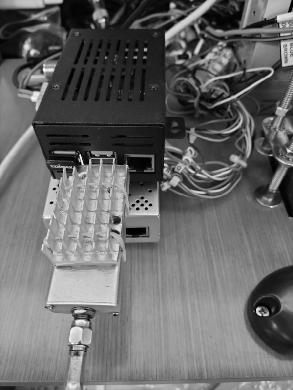
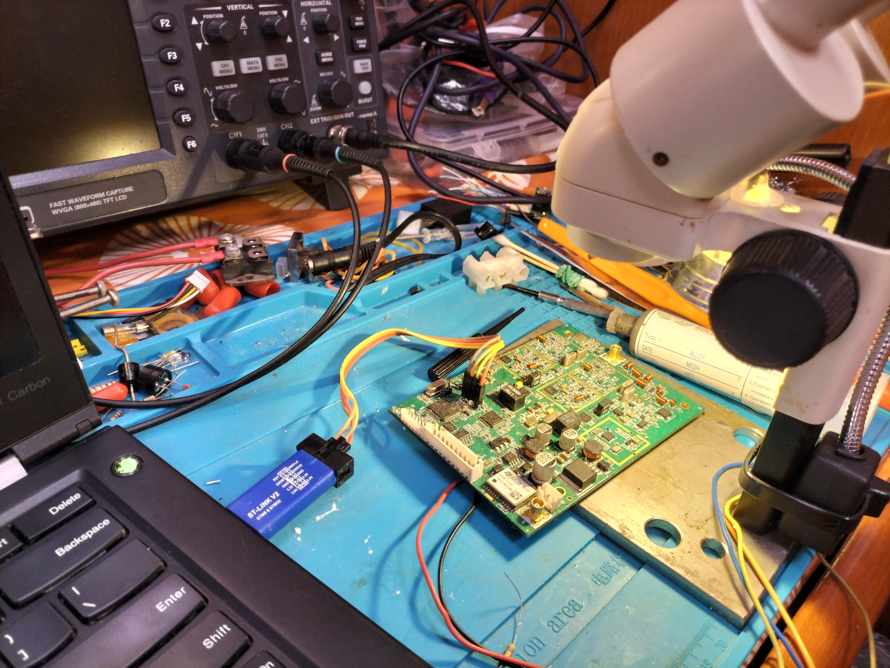

# AIS Systems Investigation, Reverse Engineering & Repair

## Overview
This repository documents a series of practical projects investigating AIS (Automatic Identification System) behaviour, including:

- Protocol-level analysis (TDMA, timeslots, message structure)
- RF transmission and reception using SDR platforms
- Embedded system repair and development (STM32 / CMX7042-type architectures)
- Real-world system integration using mobile and satellite networks

The focus throughout is on **real-world system behaviour**, rather than purely theoretical models or vendor assumptions.

---

## AIS Protocol & System Behaviour Analysis

### TDMA Structure
- 1-minute frames
- 2250 timeslots (~26.67 ms per slot)

### AIS Classes
- **SOTDMA** (Class A / B+)
- **CSTDMA** (Class B)

### Key Investigations
- SDR-based timeslot alignment challenges
- GPS/PPS synchronisation
- Behaviour of non-compliant transmitters

### Observations
- Slot usage patterns
- Transmission overlap and collisions
- Deviations from expected protocol operation

---

## SDR-Based AIS Transmission & Limitations

### Platform
- HackRF One

### Capabilities
- AIS packet generation (GMSK, 9.6 kbps)
- RF spectrum and channel analysis

### Key Finding
USB SDR platforms lack deterministic timing, making reliable AIS timeslot alignment impractical.

### Constraints
- USB latency and buffering
- No hardware timestamping
- No GPS-disciplined timing

### Conclusion
Accurate AIS transmission requires:
- Hardware-timed SDRs (e.g. USRP)
- GPS synchronisation

---

## AIS over IP & Starlink Integration

Developed a system to extend AIS beyond VHF limitations.

### Mobile AIS System
- Android (F-Droid + Termux + Termux-API)
- GPS via `termux-location`
- AIS generation using `pyAIS`
- NMEA 0183 formatting (`AIVDM` / `AIVDO`)

### Connectivity
- TCP/IP transmission over Starlink
- Over-the-horizon AIS capability (~20–30 NM RF limit bypassed)

### Features
- AIS transmission to remote aggregation platforms
- AIS reception and forwarding pipelines

### Outcome
Portable AIS relay system independent of RF range.

---https://github.com/matthew-quirke/ais-reverse-engineering-and-repair/blob/main/README.md

## SDR-Based AIS Reception & Relay

### Pipeline
- VHF AIS capture via SDR
- Message decoding
- Forwarding over TCP/IP (Starlink / mobile)

### Result
- Combined RF + IP AIS architecture
- Real-world validation of extended AIS distribution

---

## AIS Device Investigation & Reverse Engineering

### Non-Compliant AIS Devices

Investigated low-cost AIS transceivers:

- Attempted modification of fishing net AIS device into a transponder
- Observed failure to honour AIS TDMA timeslot allocation

### Behaviour
- No proper carrier-sense
- Relies on other stations to defer

### Hardware Findings
- Minimal or absent:
  - Receive/sensing circuitry
  - Proper TDMA mechanisms

### Impact
- Increased collision risk
- Network congestion
- Reduced reliability in dense environments

---

## VESPA WatchMate Analysis & Modification

### Work Performed
- Power system analysis
- RF behaviour investigation
- Custom power input design (bypassing proprietary connector)

### Tools
- SDRAngel (Linux)
- SDR capture tools

### Measurements
- Timeslot usage and alignment
- Transmission strength
- Channel occupancy and collisions

---

## Embedded Systems Repair & Development

### Platform
- STM32F103 (later migrated to ESP32)
- CMX7042-type RF/baseband architecture

### Work
- Microcontroller replacement
- Firmware redevelopment via SWD (ST-Link)
- System restoration:
  - Firmware
  - Peripherals
  - Communications

### Challenges
- Limited documentation
- Vendor constraints
- Hardware/software integration

---

## MAIANA AIS Project – Hardware Improvements

### Issues Identified
- Component Symbol layout issues
- Signal integrity problems
- Component obsolescence

### Improvements
- Added driver/buffer circuitry
- Improved STM32 interface protection
- Replaced unavailable RF components

---

## AIS Security & Protocol Investigation

### Focus Areas
- Authenticity (identity verification)
- Non-repudiation
- Spoofing detection
- Resilience to DoS / disruption

### Constraints
- 9.6 kbps bandwidth
- Strict TDMA timing
- Large legacy device base

### Approaches Explored
- Lightweight authentication
- Backward-compatible overlays
- Anomaly detection

### Context
- AIS is vulnerable to spoofing and manipulation
- Increasing relevance in contested maritime regions

### Standards Awareness
- VDES (VHF Data Exchange System)

---

## Tools & Technologies

### RF & Instrumentation
- HackRF SDR
- SDRAngel
- Oscilloscopes
- RF test equipment

### Embedded Systems
- STM32 (F103)
- ESP32
- SWD / JTAG
- Raspberry Pi
- Arduino

### Software
- Python
- Bash
- SCPI
- NMEA / AIS encoding

### Systems
- Linux (Debian)
- Android (Termux)
- TCP/IP networking

---

## Key Outcomes

- Built working AIS TX/RX systems
- Identified SDR AIS transmission limitations
- Developed over-the-horizon AIS relay (Starlink)
- Repaired and rebuilt AIS hardware at low level
- Improved open-source AIS hardware robustness
- Performed protocol and RF-level analysis

---

## Portfolio

- GitHub: https://github.com/matthew-quirke
